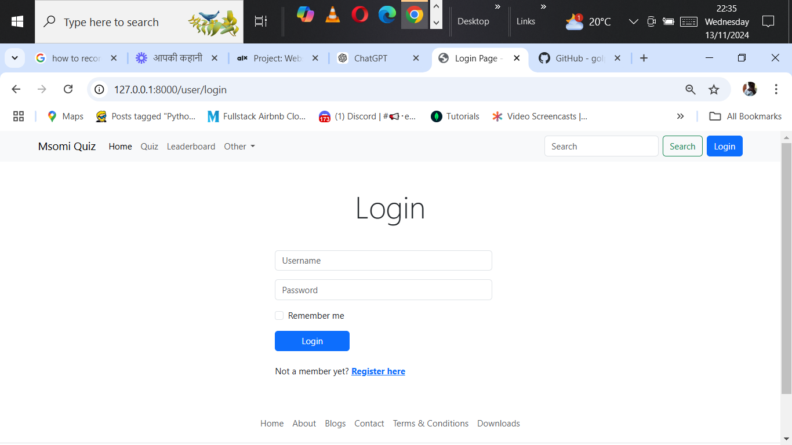

QuizApp
QuizApp is a web-based application built with the Django framework. The application allows users to register, log in, and take quizzes. Each user has a profile page that displays their information, quiz history, and scores. Admin users can manage quizzes, monitor user activity, and access detailed user profiles.

Table of Contents
Features
Installation
Configuration
Running the Application
Usage
Technologies Used
Screenshots
License
Features
User Authentication: Register, log in, and log out functionalities.
Profile Management: Users can view and edit their profiles with images and personal information.
Quiz Management: Admins can create, update, and delete quizzes.
Quiz Participation: Users can take quizzes, see their scores, and view submission history.
Responsive Design: User-friendly and responsive layout suitable for desktop and mobile.
Installation
Follow these steps to set up and run the application on your local machine.

Prerequisites
Python 
Django 
PostgreSQL 
Clone the Repository

git clone https://github.com/golphat1/Quiz-app.git
cd Quiz-app
Set Up Virtual Environment
bash
Copy code
python -m venv venv
source venv/bin/activate  # For MacOS/Linux
# OR
venv\Scripts\activate  # For Windows
Install Dependencies

pip install -r requirements.txt
Database Configuration
If you’re using PostgreSQL, update the following settings in settings.py:

DATABASES = {
    'default': {
        'ENGINE': 'django.db.backends.postgresql',
        'NAME': 'dbtest',
        'USER': 'postgres',
        'PASSWORD': 'password',
        'HOST': 'localhost',
        'PORT': '5432',
    }
}
Run the database migrations:

python manage.py migrate

python manage.py collectstatic
Configuration
Setting Up Environment Variables
In the root directory, create a .env file to manage environment variables. Add the following variables:

makefile
Copy code
SECRET_KEY=your_secret_key
DEBUG=True
ALLOWED_HOSTS=localhost,127.0.0.1
DATABASE_URL=your_database_url  # if using Django-environ

Running the Application
Start the development server:
python manage.py runserver
Open a web browser and go to http://127.0.0.1:8000 to access the app.

Usage
User Actions
Sign Up: New users can sign up by providing basic information.
Profile Editing: Users can edit their profile information, including uploading a profile image.
Take Quizzes: Users can select quizzes, answer questions, and view scores.
Quiz History: The profile page displays the quizzes a user has attempted and their results.
Admin Actions
Manage Quizzes: Admins can add, edit, or delete quizzes.
View User Profiles: Admins have access to detailed user profiles, including email addresses and submission histories.
Technologies Used
Frontend:

HTML/CSS
Bootstrap (for responsive design)
JavaScript (for interactivity)
Backend:

Django 
PostgreSQL
Django REST Framework (optional, if API endpoints are used)

Screenshots

License
This project is licensed under the MIT License. See the LICENSE file for details.

Author: golphat@yahoo.com